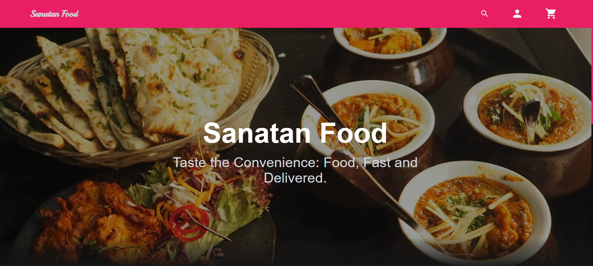

# 🍽️ Sanatan Food – Backend API

<p align="center">
  
</p>


A **Spring Boot–based backend service** for a modern food ordering & restaurant management platform.
This project is designed with **clean architecture**, **scalable APIs**, and **real‑world backend practices** in mind.

---
## 🚀 Project Overview

**Sanatan Food Backend** powers the core server‑side functionality of a food delivery system, including:

* Restaurant & menu management
* Order handling
* Request/response DTO-based APIs
* Modular service architecture

Built to be **frontend‑agnostic**, **secure**, and **deployment‑ready**.


---

## 🛠️ Tech Stack

* **Java 17**
* **Spring Boot**
* **Spring Web (REST APIs)**
* **Spring Data JPA**
* **Hibernate**
* **Maven**
* **MySQL** (can be switched easily)

---

## 📁 Project Structure

```text
backend-spring-boot/
├── src/main/java/com/sanatan
│   ├── config        # Configuration classes
│   ├── controller    # REST Controllers
│   ├── domain        # Core domain logic
│   ├── dto           # Data Transfer Objects
│   ├── exception     # Custom exception handling
│   ├── model         # JPA Entities
│   ├── repository    # Data access layer
│   ├── request       # API request models
│   ├── response      # API response models
│   ├── service       # Business logic
│   └── SanatanFoodApplication.java
│
├── src/main/resources
│   └── application.properties
│
├── pom.xml
└── README.md
```

---

## 🔑 Key Features

* ✅ Layered architecture (Controller → Service → Repository)
* ✅ Clean DTO & Request/Response separation
* ✅ Centralized exception handling
* ✅ Easy database configuration
* ✅ Production‑ready Maven build

---

## ⚙️ Setup & Installation

### 1️⃣ Clone the Repository

```bash
git clone https://github.com/your-username/Sanatan-Food-Backend.git
cd Sanatan-Food-Backend
```

### 2️⃣ Configure Database

Update `application.properties`:

```properties
spring.datasource.url=jdbc:mysql://localhost:3306/sanatan_food
spring.datasource.username=root
spring.datasource.password=your_password

spring.jpa.hibernate.ddl-auto=update
spring.jpa.show-sql=true
```
### 3️⃣ Run the Application

```bash
mvn spring-boot:run
```

Application will start at:

```
http://localhost:8080
```

---

## 🧪 Build & Test

```bash
mvn clean install
```

Generates a JAR file inside the `target/` directory.

---

## 🌍 API Ready for Frontend

This backend is designed to seamlessly integrate with:

* React
* Angular
* Mobile apps (Android / iOS)

---

## 📌 Future Enhancements

* 🔐 JWT Authentication & Authorization
* 🛒 Cart & Order Tracking
* 💳 Payment Gateway Integration
* 📦 Docker Support
* ☁️ Cloud Deployment (AWS / Railway / Render)

---

## 🤝 Contributing

Contributions are welcome!
Feel free to **fork**, **raise issues**, or **submit pull requests**.

---
## 👨‍💻 Author & Contributors
<a href="https://github.com/gitKeshav11/Sanatan_Food-Full_Stack_Project/graphs/contributors">
  
</a>

## 📞 Contact

### **Keshav Upadhyay**  
**Role:** Backend Developer (Java & Spring Boot)  
📧 Email: [keshavupadhyayje@gmail.com](mailto:keshavupadhyayje@gmail.com)  
🔗 LinkedIn: [Keshav Upadhyay](https://www.linkedin.com/in/keshavupadhyayje/)  
🐙 GitHub: [gitKeshav11](https://github.com/gitKeshav11)  

### **Jyoti Singh**  
**Role:** Frontend Support / Collaborator  
📧 Email: [kumarijyotije@gmail.com](mailto:kumarijyotije@gmail.com)  
🔗 LinkedIn: [Jyoti Singh](https://www.linkedin.com/in/jyotisinghje/)  
🐙 GitHub: [Jyotisingh133](https://github.com/Jyotisingh133)  

-------------------------------------------------------------
📌 *Building real‑world, scalable backend systems.*


--------------------
⭐ If you like this project, don’t forget to **star the repository**!
